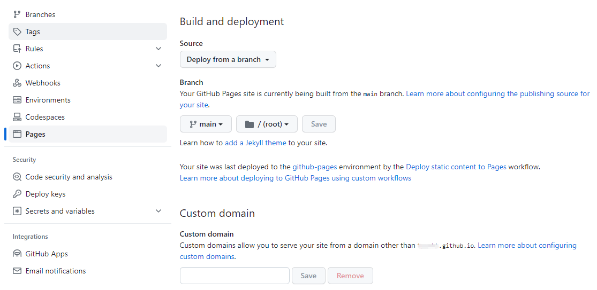
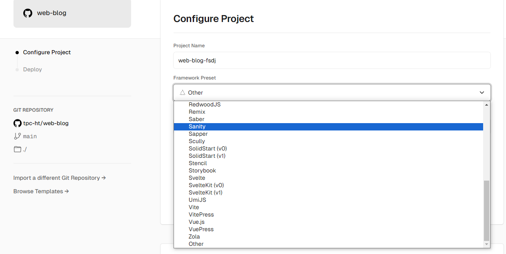

# github 在线预览部署

步骤：Settings->Pages->Branch->(选择分支)->Save

注：

1. 必须是公开库
2. 只能部署静态页面（本地能直接打开）
3. 访问地址为：https://{自定义前缀}.github.io/{库名}/dist/index.html

# vercel

## 简介

web 项目在线部署，并自动分配域名。

## 部署

1. 使用 github 登录 vercel 并授权
2. 选择仓库，并选择分支
3. 选择项目打包工具
4. 等待部署完成
   
