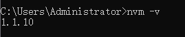

# 简介

nvm（Node Version Manager）是一款非常实用的 nodejs 版本管理工具，它能够在同一台机器上有选择地安装和切换多个 Node.js 版本，从而解决了不同项目对 Node.js 版本依赖的问题。

**在安装 nvm 之前，需要先卸载计算机上已经存在的 Node.js 版本，确保没有残留的文件影响后续操作。**

# 安装

去 github [下载 nvm](https://github.com/coreybutler/nvm-windows/releases) 找到 `nvm-setup.zip` 点击下载
解压获取其中的 `nvm-setup.exe` 安装包并安装。

打开控制台查看 nvm 版本



# nvm 常用指令

```bash
# 查看当前的版本
nvm -v
# 查看已经安装的版本
nvm list
# 查看网络可以安装的版本
nvm list available
# 安装制定版本的node 并且可以指定平台 version 版本号 arch 平台
nvm install [arch]
# 切换指定的node版本和位数
nvm use [version] [arch]
# 卸载指定的版本
nvm uninstall [version]
# 查看当前系统的位数和当前nodejs的位数
nvm arch
# 打开nodejs版本控制
nvm on
# 关闭nodejs版本控制
nvm off
# 查看和设置代理
nvm proxy [url]
# 设置或者查看setting.txt中的node_mirror，如果不设置的默认是 https://nodejs.org/dist/
nvm node_mirror [url]
# 设置或者查看setting.txt中的npm_mirror,如果不设置的话默认的是：https://github.com/npm/npm/archive/
nvm npm_mirror [url]
# 设置和查看root路径
nvm root [path]
```

# 卸载

`windows` 左下角搜索 `添加或删除程序` 找到 nvm 应用点击卸载。（node 删除同理）
